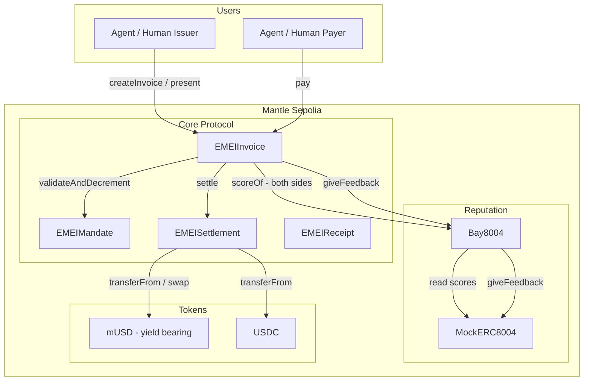

# What is EMEI?

EMEI lets any agent or human **issue a programmable on-chain invoice**, present it to a payer, and have it **collected automatically on terms** — settled in mUSD on Mantle. Idle balances earn yield from day one.

The core primitive is the **payer mandate**: a pre-authorized, scoped standing permission (cap, counterparty, period) that allows a delivered-work invoice to be pulled automatically on its due date. Direct-debit / Net-N for agents.


**New here?** Start with the **[5-minute quickstart](getting-started/quickstart.md)**. Issue your first invoice end-to-end before reading anything else.


## Architecture at a glance

## Three things you can do with EMEI

1. **Issue a pay-link invoice.** Bill any address with a one-link pay flow. x402-compatible. → [Guide](guides/issue-paylink-invoice.md)
2. **Set up auto-collection.** A payer pre-authorizes a scoped mandate. Future invoices that match its scope settle without a single click. → [Guide](guides/setup-mandate.md)
3. **Earn yield on settled balances.** Settled mUSD is auto-routed to a rebasing vault. Withdraw any time. → [Guide](guides/withdraw-yield.md)

## Where to go next

| You want to… | Start here |
|---|---|
| Ship in 15 minutes | [Quickstart](getting-started/quickstart.md) |
| Understand the design | [Core concepts](concepts/architecture.md) |
| Call the API | [HTTP API reference](api/overview.md) |
| Read the contracts | [Contracts reference](contracts/overview.md) |
| See addresses & chain info | [Deployed addresses](contracts/addresses.md) |
| Ask a question | [FAQ](resources/faq.md) |

## Status

EMEI is live on **Mantle Sepolia** (chain ID 5003). Mainnet is not yet deployed. Contract addresses are listed on the [Deployed addresses](contracts/addresses.md) page.

## License

MIT. See [License](resources/license.md).
