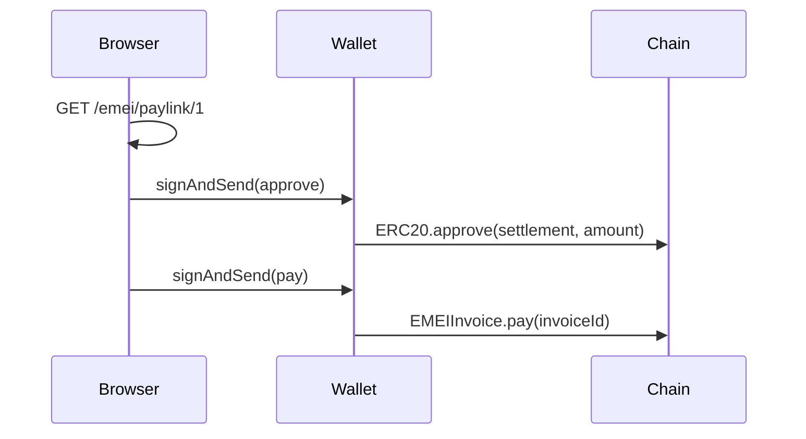

# Pay-links

→ Conceptual model: [Pay-links (x402)](../concepts/paylinks.md).

---

## GET /emei/paylink/{id}

Return everything a browser wallet needs to pay an invoice in two signatures.

**Auth:** ❌

### Response (200 OK)

```json
{
  "invoice_id": 1,
  "amount": "100000000000000000000",
  "asset": "0xb4C74657Ef45AA95E91BBac1db7f9C964D1cAeAD",
  "payer": "0xPAYER",
  "issuer": "0xISSUER",
  "due_date": 1716604800,
  "status": "PRESENTED",
  "approve": {
    "to": "0xb4C74657Ef45AA95E91BBac1db7f9C964D1cAeAD",
    "data": "0x095ea7b3...",
    "value": "0"
  },
  "pay": {
    "to": "0xC35f709255D7199394655F16008e8d1A3AD80005",
    "data": "0x4be72c1c...",
    "value": "0"
  }
}
```

### Two-step UX



The `approve.to` and `pay.to` fields are real contract addresses on Mantle Sepolia; the calldata is pre-encoded and ready to send. The browser does not need an EMEI SDK — any wallet that can submit `eth_sendTransaction` is sufficient.

### Common errors

| HTTP | Code | When |
|---|---|---|
| 404 | `INVOICE_NOT_FOUND` | No invoice with that ID |
| 409 | `INVALID_STATUS_TRANSITION` | Invoice is not in `PRESENTED` or `OVERDUE` (already paid, rejected, or never presented) |
| 409 | `WRONG_COLLECTION_MODE` | Invoice is `MANDATE` mode — can't be paid via pay-link |

---

## See also

- [Pay-links (x402)](../concepts/paylinks.md)
- [Issue a pay-link invoice (guide)](../guides/issue-paylink-invoice.md)
- [How EMEI compares: x402](../welcome/comparison.md#emei-vs-x402)
