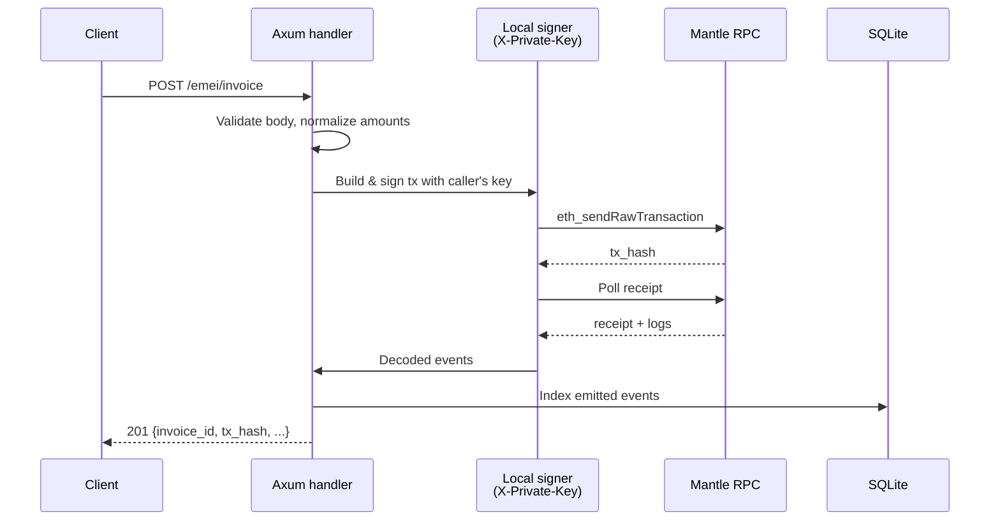

# System overview

> Implementation-level companion to [Concepts: Architecture](../concepts/architecture.md). This page focuses on the Facilitator's runtime shape rather than the conceptual model.

## Process layout

A single `emei-server` process runs:

| Component | Type | Concurrency model |
|---|---|---|
| Axum HTTP server | Tokio task | Per-request task |
| Event Indexer | Long-running Tokio task | One stream per contract |
| Auto-Collector | Periodic Tokio task | Single-flight every 10s |
| Overdue Scanner | Periodic Tokio task | Single-flight every 60s |
| Receipt Batcher | Periodic Tokio task | Single-flight every 30s |
| SQLite pool | `sqlx` connection pool | Shared across all tasks |
| Alloy provider | HTTP `alloy-rs` provider | Shared across all tasks |

All tasks are spawned in `bin/server.rs` and share an `AppState`.

## Request flow (write endpoint)



## Read endpoint flow

Read endpoints typically hit SQLite (the local event index) for low latency, falling through to RPC only when the database lacks the data:

```
GET /emei/invoice/{id}
  → query SQLite for the latest indexed state
  → if missing, fall through to EMEIInvoice.getInvoice() on-chain
```

## On-chain interactions

| Caller key | Calls |
|---|---|
| `X-Private-Key` (per request) | `register`, `createInvoice`, `present`, `pay`, `createMandate`, `revokeMandate`, `withdraw` |
| `OPERATOR_PRIVATE_KEY` | `collect`, `markOverdue` |
| `RECEIPT_BATCHER_PRIVATE_KEY` | `postMerkleRoot` |

The two operator keys hold MNT only. They are never recipients of user funds.

## See also

- [Background services](background-services.md)
- [Event indexer & SQLite schema](indexer.md)
- [Revert decoding](revert-decoding.md)
- [Architecture overview (concepts)](../concepts/architecture.md)
