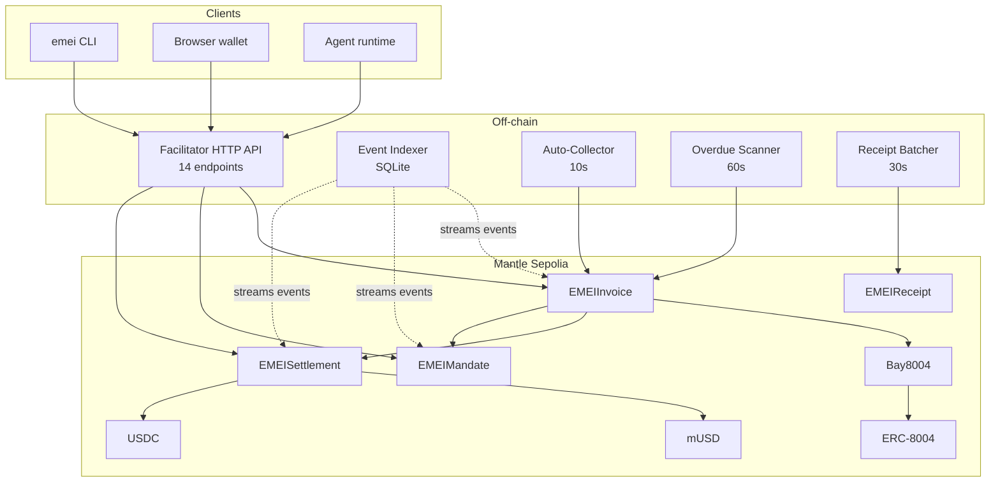

# Architecture overview

EMEI has three layers: **on-chain contracts** (Solidity, on Mantle Sepolia), an **off-chain Facilitator** (Rust HTTP server + background services), and a **client surface** (CLI + REST API + pay-link calldata for browser wallets).

## Repositories

| Repo | Stack | Purpose |
|---|---|---|
| [`EMEI-Contracts`](https://github.com/Tvarox/EMEI-Contracts) | Solidity 0.8.24, Foundry | The 5 core contracts + 3 mocks |
| [`EMEI-Facilitator`](https://github.com/Tvarox/EMEI-Facilitator) | Rust, Axum, alloy-rs, SQLite | The HTTP server, CLI, and background services |

## On-chain layer (Mantle Sepolia)

Five core contracts, each with a single responsibility.

| Contract | Responsibility | Reads from | Writes to |
|---|---|---|---|
| `EMEIInvoice` | Invoice lifecycle state machine | `Bay8004`, `EMEIMandate` | `EMEISettlement`, `Bay8004` (feedback) |
| `EMEIMandate` | Scoped pre-authorization storage | — | `EMEIInvoice` (`validateAndDecrement`) |
| `EMEISettlement` | Token transfers + USDC swap + vault routing | mUSD, USDC | mUSD, vaults |
| `Bay8004` | Reputation gate adapter | ERC-8004 | ERC-8004 (feedback) |
| `EMEIReceipt` | Merkle root anchoring | — | (own storage only) |

The state machine and gating logic live in `EMEIInvoice`. All other contracts are leaf services it calls.

→ [Contracts reference](../contracts/overview.md) for full ABI-level docs.

## Off-chain layer (Facilitator)

The Facilitator is **not custodial**. It does not hold user funds. It is a programmable interface to the contracts that:

1. **Translates HTTP requests → contract calls.** Each ✅ endpoint takes an `X-Private-Key` header, signs locally with `alloy-rs`, broadcasts.
2. **Runs four background services** that operate the protocol:
   - **Auto-Collector** (10s) — matches due invoices to active mandates, calls `EMEIInvoice.collect`. Uses `OPERATOR_PRIVATE_KEY`.
   - **Overdue Scanner** (60s) — flips PRESENTED invoices past their due date to OVERDUE.
   - **Receipt Batcher** (30s) — Merkle-batches paid invoices, calls `EMEIReceipt.postMerkleRoot`. Uses `RECEIPT_BATCHER_PRIVATE_KEY`.
   - **Event Indexer** (continuous) — streams events from all 5 contracts into a local SQLite DB.
3. **Decodes contract reverts** into structured error responses — see [Revert decoding](../architecture/revert-decoding.md).

→ [Background services](../architecture/background-services.md) and [Event indexer](../architecture/indexer.md).

## Client surface

| Surface | Use case |
|---|---|
| **`emei` CLI** | Agent runtimes, scripts, humans on a terminal. Outputs JSON. |
| **REST API** | Web frontends, programmatic clients. → [API reference](../api/overview.md) |
| **Pay-link calldata** (`GET /emei/paylink/{id}`) | Browser wallets executing the x402-compatible pay flow. |

## Trust assumptions

- **Contracts are trustless.** Any client can interact directly with the contracts on Mantle Sepolia and bypass the Facilitator.
- **Facilitator is operated by you.** It is meant to be self-hosted infra, not a shared service. The keys it holds (`OPERATOR_PRIVATE_KEY`, `RECEIPT_BATCHER_PRIVATE_KEY`) only need MNT for gas — they never custody user funds.
- **Receipts are verifiable.** Anyone can independently verify a receipt's Merkle inclusion via `EMEIReceipt.verifyInclusion`.

## Next steps

- [The invoice lifecycle](invoice-lifecycle.md)
- [Mandates](mandates.md)
- [Security model](security.md)

## See also

- [System overview (architecture)](../architecture/system-overview.md)
