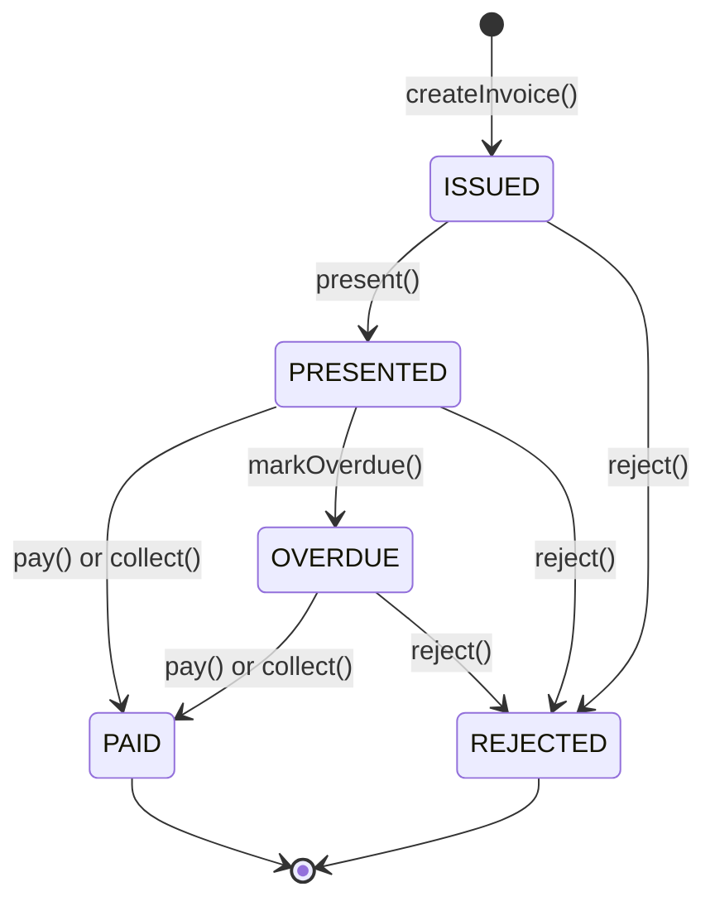

# The invoice lifecycle

An invoice on EMEI moves through a small, deterministic state machine. There are five statuses, two of which are terminal.



`PAID` and `REJECTED` are **terminal**. There is no "unpaid" or "un-rejected" — disputes happen off-chain.

## The five statuses

| Status | Meaning | Terminal? |
|---|---|---|
| `ISSUED` | The invoice exists. The payer has not been notified at the contract level. | No |
| `PRESENTED` | The issuer has called `present`. Payment is now expected per the terms. | No |
| `PAID` | Funds have been transferred and routed to the issuer's vault. A `settlementProof` is recorded on the invoice. | **Yes** |
| `OVERDUE` | The due date passed without payment. Collection is still possible. | No |
| `REJECTED` | The issuer cancelled, or the payer's reputation dropped below threshold at payment time. | **Yes** |

## Every transition

| From | To | Function | Caller | Side effects |
|---|---|---|---|---|
| `(none)` | `ISSUED` | `createInvoice(params)` | Anyone (becomes issuer) | Reputation check on **both** issuer and payer; emits `InvoiceCreated`, `StatusChanged` |
| `ISSUED` | `PRESENTED` | `present(invoiceId)` | Issuer only | Records `presentedAt = block.timestamp`; emits `InvoicePresented`, `StatusChanged` |
| `ISSUED` | `REJECTED` | `reject(invoiceId, reason)` | Issuer only | Terminal; emits `InvoiceRejected`, `StatusChanged` |
| `PRESENTED` | `PAID` | `pay(invoiceId)` | Payer only | Re-checks payer reputation; calls `EMEISettlement.settle`; calls `Bay8004.giveFeedback` for both sides; records `settlementProof`; emits `InvoicePaid`, `StatusChanged` |
| `PRESENTED` | `PAID` | `collect(invoiceId, mandateId)` | **Anyone** (typically Auto-Collector) | Calls `EMEIMandate.validateAndDecrement` (counterparty + category + cap + window); then same effects as `pay()`; emits `MandateCollected`, `InvoicePaid`, `StatusChanged` |
| `PRESENTED` | `OVERDUE` | `markOverdue(invoiceId)` | **Anyone** (typically Overdue Scanner) | Only succeeds if `block.timestamp > dueDate`; emits `InvoiceOverdue`, `StatusChanged` |
| `PRESENTED` | `REJECTED` | `reject(invoiceId, reason)` | Issuer only | Terminal; emits `InvoiceRejected`, `StatusChanged` |
| `OVERDUE` | `PAID` | `pay(invoiceId)` or `collect(invoiceId, mandateId)` | Payer / Anyone | Same effects as the `PRESENTED → PAID` transition |
| `OVERDUE` | `REJECTED` | `reject(invoiceId, reason)` | Issuer only | Terminal; emits `InvoiceRejected`, `StatusChanged` |


`pay` and `collect` *also* perform a **second reputation check on the payer**. If the payer's score has dropped below `minReputation` since invoice creation, the call reverts with `ReputationTooLow`. The invoice stays in its current status — no auto-rejection.


## Authorization rules

| Function | `msg.sender` constraint |
|---|---|
| `createInvoice` | Any address; recorded as `issuer` |
| `present` | Must equal the invoice's `issuer` |
| `pay` | Must equal the invoice's `payer` |
| `collect` | **Permissionless** — anyone can call. The mandate's scope is the access control. |
| `markOverdue` | **Permissionless** — only the timestamp gates it. |
| `reject` | Must equal the invoice's `issuer` |
| `setMinReputation` | Owner of `EMEIInvoice` only |

## Terms — when is an invoice "due"?

The `Terms` field on an invoice has three forms:

| Term type | Due date is… |
|---|---|
| `DUE_ON_RECEIPT` | `presentedAt` (immediately on `present`) |
| `NET_N_DAYS` | `presentedAt + netDays * 86400`. `netDays` ∈ [1, 365]. |
| `MILESTONES` | Each milestone has its own `dueDate`. The invoice is fully due when the last milestone is. Milestone amounts must sum to the invoice `amount`. Max 10. |

The Auto-Collector and Overdue Scanner both compute "due" the same way.

## Events emitted

```solidity
event InvoiceCreated(uint256 indexed invoiceId, address indexed issuer, address indexed payer, uint256 amount, CollectionMode collectionMode);
event InvoicePresented(uint256 indexed invoiceId, address indexed payer, uint256 presentedAt);
event InvoicePaid(uint256 indexed invoiceId, address indexed payer, uint256 amount, bytes32 settlementProof);
event InvoiceOverdue(uint256 indexed invoiceId, address indexed payer);
event InvoiceRejected(uint256 indexed invoiceId, string reason);
event StatusChanged(uint256 indexed invoiceId, Status previousStatus, Status newStatus, uint256 timestamp);
```

The Event Indexer streams all of these into the local SQLite DB. Query them via `GET /emei/statement`.

## Worked example: the happy path

```
t=0   alice creates invoice #1 for bob, 100 mUSD, NET_7
        → ISSUED   (InvoiceCreated emitted)
t=10  alice presents invoice #1
        → PRESENTED (InvoicePresented, dueDate = t+604800)
t=15  bob calls pay(1)
        → settle: 100 mUSD bob → vault
        → giveFeedback(alice, 100), giveFeedback(bob, 100)
        → PAID     (InvoicePaid, settlementProof = 0xabc...)
t+30  Receipt Batcher includes invoice #1 in batch #N
        → MerkleRootPosted
```

## Worked example: an OVERDUE → PAID path

```
t=0     issuer creates + presents invoice (NET_3)
t+3d    invoice not yet paid; Overdue Scanner runs
        → markOverdue(1) succeeds because block.timestamp > presentedAt + 3 days
        → OVERDUE  (InvoiceOverdue emitted)
t+5d    payer finally calls pay(1) — succeeds (still possible from OVERDUE)
        → PAID     (InvoicePaid emitted)
```

## Worked example: a REJECTED outcome

```
t=0   issuer creates invoice for payer with current score 600 (threshold = 500)
t=1   issuer presents
        → PRESENTED
t=2   payer's score drops to 400 (e.g., bad feedback elsewhere)
t=3   payer calls pay(1)
        → revert ReputationTooLow(payer, 400, 500)
        → invoice STAYS PRESENTED — not auto-rejected
t=4   issuer reviews and calls reject(1, "payer below threshold")
        → REJECTED (terminal)
```

## Next steps

- [Mandates](mandates.md) — the auto-collect path.
- [Reputation gate](reputation.md) — what `minReputation` and the score weighting actually do.
- [HTTP API: Invoices](../api/invoices.md) — call the lifecycle from your code.

## See also

- [EMEIInvoice (contracts reference)](../contracts/emei-invoice.md)
- [Events reference](../contracts/events.md)
