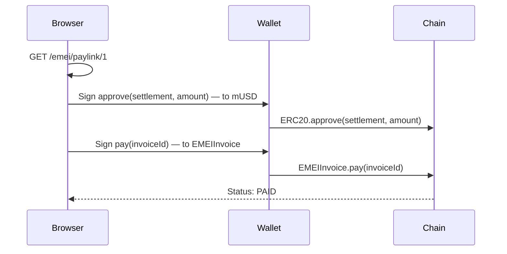

# Pay-links (x402)

A **pay-link** is the manual collection mode for EMEI invoices. Unlike mandates (which auto-collect), a pay-link requires the payer to explicitly sign a transaction — typically two signatures: `approve` + `pay`.

Pay-links are designed to be **[x402](https://www.x402.org/)-compatible**. A server that returns HTTP 402 with EMEI pay-link calldata can be satisfied by any x402-aware client.

## Endpoint

```
GET /emei/paylink/{invoice_id}
```

Returns:

```json
{
  "invoice_id": 1,
  "amount": "100000000000000000000",
  "asset": "0xb4C74657Ef45AA95E91BBac1db7f9C964D1cAeAD",
  "payer": "0xPAYER",
  "issuer": "0xISSUER",
  "due_date": 1716604800,
  "approve_calldata": "0x095ea7b3...",
  "pay_calldata": "0x4be72c1c...",
  "settlement_address": "0xfdCb7bA077069A7Da44711Ee6bdB49174AFA4dD0",
  "invoice_address": "0xC35f709255D7199394655F16008e8d1A3AD80005"
}
```

## The two-step flow



## When to use pay-links vs. mandates

| Use pay-links when… | Use mandates when… |
|---|---|
| Each payment is a deliberate human (or agent) decision | Spend is recurring or programmatic |
| Counterparty is unknown ahead of time | Counterparty is known and trusted |
| The payer has no on-chain pre-authorization budget | The payer can pre-authorize a budget |
| Integrating with x402-style HTTP 402 flows | Building agent-to-agent automation |

You can mix: an invoice's `collectionMode` is set per-invoice. The same payer can have outstanding invoices in both modes.

## Next steps

- [Issue a pay-link invoice](../guides/issue-paylink-invoice.md)
- [HTTP API: GET /emei/paylink/{id}](../api/paylinks.md)

## See also

- [How EMEI compares: x402](../welcome/comparison.md#emei-vs-x402)
- [Mandates](mandates.md)
