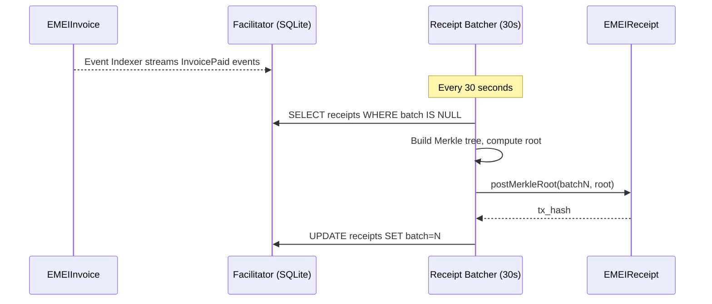

# Receipt anchoring

Every paid invoice produces a 32-byte receipt commitment. Receipts are aggregated off-chain into a Merkle tree, and the root is posted on-chain via `EMEIReceipt.postMerkleRoot` — anchoring proof of payment in a way anyone can independently verify, without trusting the Facilitator.

## How it works



## Verifying inclusion

Any client can verify a receipt was included in an anchored batch:

```bash
curl http://localhost:8080/emei/verify/1
```

Response:

```json
{
  "invoice_id": 1,
  "batch_number": 42,
  "merkle_root": "0xabc...",
  "leaf": "0xdef...",
  "proof": ["0x...", "0x..."],
  "verified": true
}
```

The `verified` flag comes from calling `EMEIReceipt.verifyInclusion(batch, leaf, proof)` on-chain.

## Batch cadence

- Default interval: **30 seconds**.
- Configurable via the `RECEIPT_BATCHER_INTERVAL_SEC` env var.
- Empty batches are skipped — no on-chain call when there are no new receipts.

## Why this design

- **Trust-minimization.** A receipt's validity does not depend on the Facilitator. Anyone can re-derive the leaf, fetch the on-chain root, and verify.
- **Cost amortization.** One on-chain write per 30s ≫ one write per invoice.
- **Auditability.** A batch number + root pair is a permanent commitment.

## Functions

| Function | Caller | Purpose |
|---|---|---|
| `postMerkleRoot(uint256 batchNumber, bytes32 root)` | Authorized poster (`RECEIPT_BATCHER_PRIVATE_KEY`) | Anchor a batch's root |
| `getMerkleRoot(uint256 batchNumber)` | Anyone | Read a stored root |
| `getLatestBatch()` | Anyone | Latest posted batch number |
| `verifyInclusion(uint256 batch, bytes32 leaf, bytes32[] proof)` | Anyone | Verify a leaf is in a batch |

## Next steps

- [Verify a receipt's Merkle inclusion](../guides/verify-receipt.md) — the how-to.
- [EMEIReceipt (contracts reference)](../contracts/emei-receipt.md)

## See also

- [Background services: Receipt Batcher](../architecture/background-services.md)
- [HTTP API: GET /emei/verify/{id}](../api/receipts.md)
