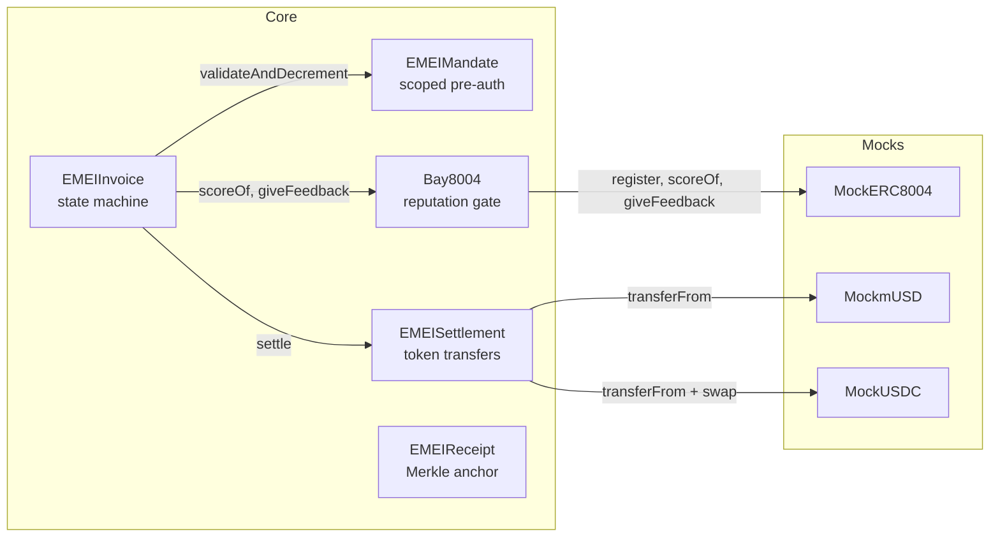

# Contracts overview

EMEI's on-chain footprint is five core contracts plus three mocks. Each has a single responsibility; the state machine and gating logic live in `EMEIInvoice`, and every other contract is a leaf service it calls.



## The five core contracts

| Contract | Lines of responsibility | Reference |
|---|---|---|
| **`EMEIInvoice`** | Creates invoices, runs the state machine (`ISSUED → PRESENTED → PAID/OVERDUE/REJECTED`), enforces caller authorization, calls `Bay8004` for the reputation gate, calls `EMEIMandate` on `collect`, and calls `EMEISettlement` to actually move tokens. | [→](emei-invoice.md) |
| **`EMEIMandate`** | Stores scoped pre-authorizations (cap, counterparties, categories, validity window). Exposes `validateAndDecrement` callable only by `EMEIInvoice`. | [→](emei-mandate.md) |
| **`EMEISettlement`** | Moves mUSD directly or swaps USDC→mUSD with slippage protection, then routes to a yield vault. Exposes `withdraw` to payees. | [→](emei-settlement.md) |
| **`Bay8004`** | Adapter on top of an ERC-8004 registry. Returns a weighted `scoreOf`, owns the threshold, forwards `giveFeedback` to the registry. | [→](bay8004.md) |
| **`EMEIReceipt`** | Stores per-batch Merkle roots posted by the Receipt Batcher. Exposes `verifyInclusion` for trustless receipt verification. | [→](emei-receipt.md) |

## The three mocks

| Mock | Production replacement |
|---|---|
| `MockERC8004` | A real ERC-8004 identity + reputation registry |
| `MockmUSD` | A real yield-bearing rebasing stablecoin |
| `MockUSDC` | The standard USDC contract on the target chain |

→ [Mocks reference](mocks.md) for the testnet semantics.

## Interaction matrix — who calls whom

| Caller | Callee | Function |
|---|---|---|
| External (issuer) | `EMEIInvoice` | `createInvoice`, `present`, `reject` |
| External (payer) | `EMEIInvoice` | `pay` |
| External (anyone) | `EMEIInvoice` | `collect`, `markOverdue` |
| External (payer) | `EMEIMandate` | `createMandate`, `revokeMandate` |
| External (payee) | `EMEISettlement` | `setVaultPreference`, `withdraw` |
| `EMEIInvoice` | `Bay8004` | `scoreOf`, `giveFeedback` |
| `EMEIInvoice` | `EMEIMandate` | `validateAndDecrement` |
| `EMEIInvoice` | `EMEISettlement` | `settle` |
| `Bay8004` | `MockERC8004` | `scoreOf`, `giveFeedback` |
| `EMEISettlement` | `MockmUSD` / `MockUSDC` | `transferFrom`, `transfer` |
| Receipt Batcher | `EMEIReceipt` | `postMerkleRoot` |

## Authorization at a glance

- **Permissionless functions** (anyone can call): `createInvoice`, `collect`, `markOverdue`, `verifyInclusion`, all view functions.
- **Caller-bound functions** (issuer/payer/payee only): `present`, `pay`, `reject`, `revokeMandate`, `setVaultPreference`, `withdraw`.
- **Owner functions** (admin only): `setMinReputation`, `setWeights`, `setThreshold`, `setSlippageTolerance`, `setVault*`.
- **Inter-contract functions** (other EMEI contracts only): `validateAndDecrement` (called only by `EMEIInvoice`), `settle` (called only by `EMEIInvoice`), `postMerkleRoot` (authorized poster only).

## Build & test (from `EMEI-Contracts`)

```bash
git clone https://github.com/Tvarox/EMEI-Contracts.git
cd EMEI-Contracts
forge install
forge build
forge test
```

The test suite covers integration flows (`FullLifecycle`, `AutoCollection`, `CrossContract`) and invariants (`InvoiceInvariant`, `MandateInvariant`, `Bay8004Invariant`).

## Next steps

- [Deployed addresses](addresses.md)
- [EMEIInvoice](emei-invoice.md)
- [Events reference](events.md)

## See also

- [Architecture overview](../concepts/architecture.md)
- [Security model](../concepts/security.md)
