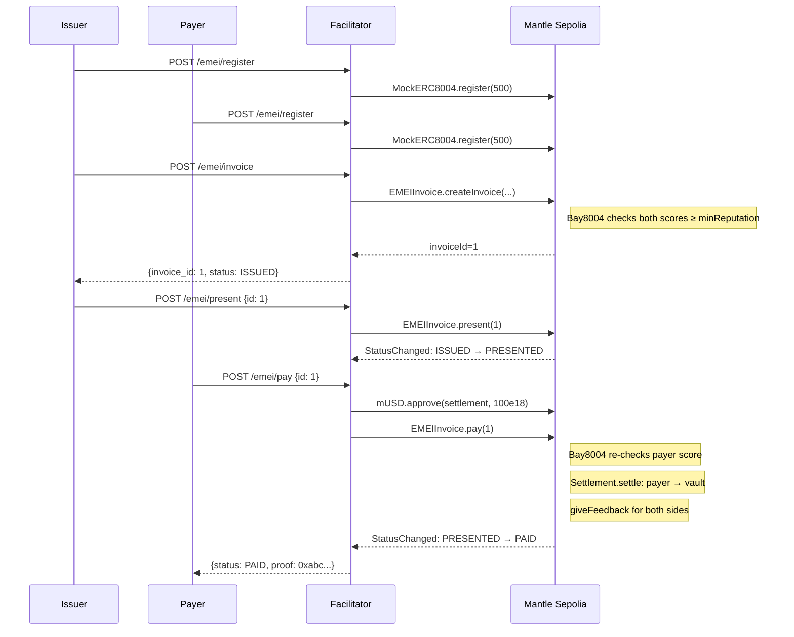

# Quickstart: your first invoice in 5 minutes

In this tutorial you will:

1. Run the Facilitator locally.
2. Register two identities (issuer + payer).
3. Create an invoice for **100 mUSD**, payable in 7 days, pay-link mode.
4. Present it.
5. Pay it.
6. Confirm it landed as `PAID` and watch the balance accrue yield.

By the end you will have exercised the full end-to-end loop on Mantle Sepolia.

## Prerequisites

- **Rust 1.75+** with `cargo`. Check with `cargo --version`.
- **Two funded testnet wallets.** You'll need one for the issuer, one for the payer.
  - Each wallet needs **MNT for gas** ([Mantle faucet](https://faucet.sepolia.mantle.xyz/)).
  - The payer also needs **mUSD** to pay with — see [Get testnet tokens](get-testnet-tokens.md).
- A clone of the `EMEI-Facilitator` repo:
  ```bash
  git clone https://github.com/Tvarox/EMEI-Facilitator.git
  cd EMEI-Facilitator
  ```


For this tutorial we assume the issuer's private key is in `$ISSUER_KEY` and the payer's in `$PAYER_KEY`. **Use disposable testnet keys only.**


## Step 1 — Run the Facilitator

In a dedicated terminal, from the repo root:

```bash
cp crates/emei-facilitator/.env .env
cargo run -p emei-facilitator --bin emei-server
```

You should see:

```
emei-server listening on 0.0.0.0:8080
event-indexer started (continuous)
auto-collector started (10s)
overdue-scanner started (60s)
receipt-batcher started (30s)
```

Leave it running. All subsequent commands hit `http://localhost:8080`.

## Step 2 — Build and configure the CLI

In a second terminal:

```bash
cargo build -p emei-cli --release
export PATH="$PWD/target/release:$PATH"
export EMEI_API_URL=http://localhost:8080
```

Verify:

```bash
emei --help
```

## Step 3 — Register the two identities

Each address must be registered in the ERC-8004 registry before it can issue or pay invoices.



```bash
export EMEI_PRIVATE_KEY=$ISSUER_KEY
emei wallet create --score 500
```



```bash
export EMEI_PRIVATE_KEY=$PAYER_KEY
emei wallet create --score 500
```



Each call returns the registration `tx_hash`. The default `minReputation` on `EMEIInvoice` is `0`, so a starting score of 500 is more than enough.


The `score` parameter is a testnet convenience for `MockERC8004`. On a production ERC-8004 registry, scores are earned, not self-assigned.


## Step 4 — Create the invoice (issuer)

Switch back to the issuer key:

```bash
export EMEI_PRIVATE_KEY=$ISSUER_KEY
```

Create a 100 mUSD invoice, Net-7, pay-link mode:

```bash
emei invoice create \
  --payer 0xPAYER_ADDRESS \
  --amount 100 \
  --asset 0xb4C74657Ef45AA95E91BBac1db7f9C964D1cAeAD \
  --terms net_n_days --net-days 7 \
  --mode pay_link \
  --line-item "API access (1000 calls):100:data-services"
```

Output:

```json
{
  "invoice_id": 1,
  "tx_hash": "0x...",
  "status": "ISSUED"
}
```

Note the `invoice_id`. We'll use `1` in the rest of the tutorial.

## Step 5 — Present the invoice

```bash
emei invoice present 1
```

Output:

```json
{
  "invoice_id": 1,
  "tx_hash": "0x...",
  "status": "PRESENTED",
  "presented_at": 1716000123
}
```

## Step 6 — Pay the invoice (payer)

Switch to the payer key:

```bash
export EMEI_PRIVATE_KEY=$PAYER_KEY
```

The payer needs to approve `EMEISettlement` to spend mUSD before paying. The CLI handles approval automatically:

```bash
emei invoice pay 1
```

Output:

```json
{
  "invoice_id": 1,
  "tx_hash": "0x...",
  "status": "PAID",
  "settlement_proof": "0xabc...",
  "amount": "100000000000000000000"
}
```


Settlement is **same-block**. The payer's mUSD has already moved into the issuer's vault and started accruing yield.


## Step 7 — Verify and watch yield accrue

Confirm the invoice's terminal status:

```bash
emei invoice get 1
```

Check the issuer's vault balance and accrued yield:

```bash
emei balance 0xISSUER_ADDRESS
```

Output:

```json
{
  "address": "0xISSUER_ADDRESS",
  "balance": "100000000000000000000",
  "accrued_yield": "0",
  "vault": "MUSD_REBASE"
}
```

Wait a few minutes and re-run — `accrued_yield` will tick up as `MockmUSD`'s `rebaseIndex` advances.

## What just happened (under the hood)



Within the next 30 seconds, the **Receipt Batcher** background service will compute a Merkle root over this and any other paid invoices in the batch and post it via `EMEIReceipt.postMerkleRoot`. You can verify inclusion with:

```bash
curl http://localhost:8080/emei/verify/1
```

## Next steps

- **Try mandate auto-collection** — eliminate the wallet popup at pay time. → [Set up mandate auto-collection](../guides/setup-mandate.md)
- **Pay with USDC instead of mUSD** — the protocol auto-swaps. → [Pay with USDC](../guides/pay-with-usdc.md)
- **Understand the lifecycle** — every state and transition. → [The invoice lifecycle](../concepts/invoice-lifecycle.md)
- **Build an agent that bills automatically** — full integration recipe. → [Build a billing agent](../guides/build-billing-agent.md)

## See also

- [HTTP API reference](../api/overview.md) — every endpoint, every parameter.
- [Troubleshooting](../resources/troubleshooting.md) — if something didn't work.
